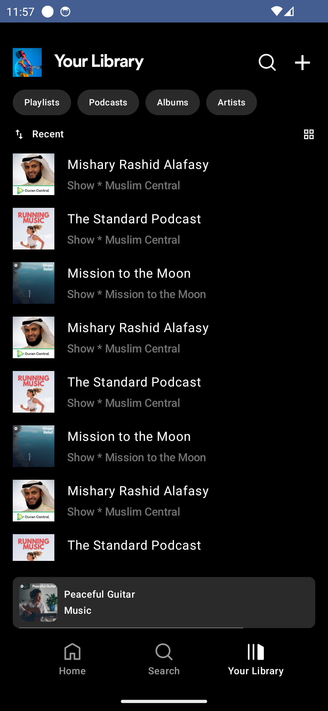
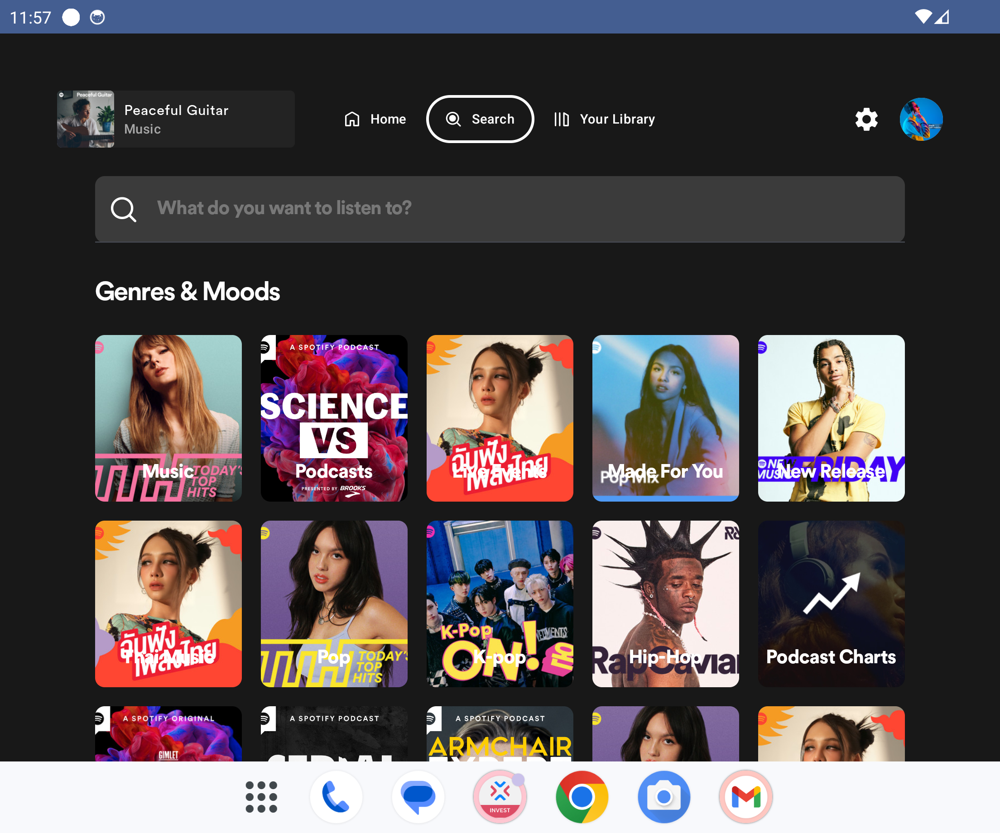
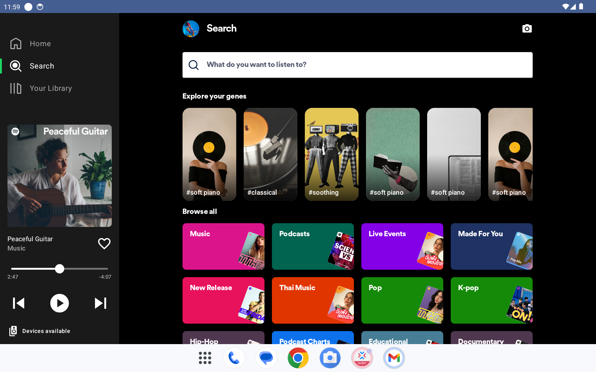

  
  

## [In progress] Spotify clone (Mobile, Tablet, Television)
This is Spotify clone built with jetpack compose supporting multiple screen size mobile, tablet and television
- MVI Clean Architecture
- Unit Testing
- UI Testing

## 📷 Mobile screen shots

### 📷 Tablet screen shots

### 📷 TV screen shots

